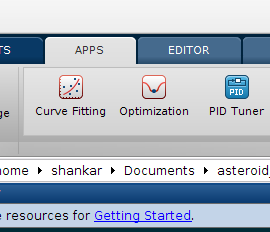
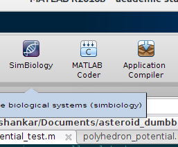
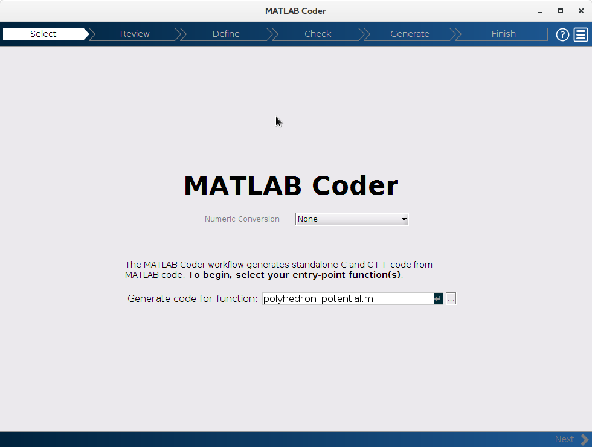
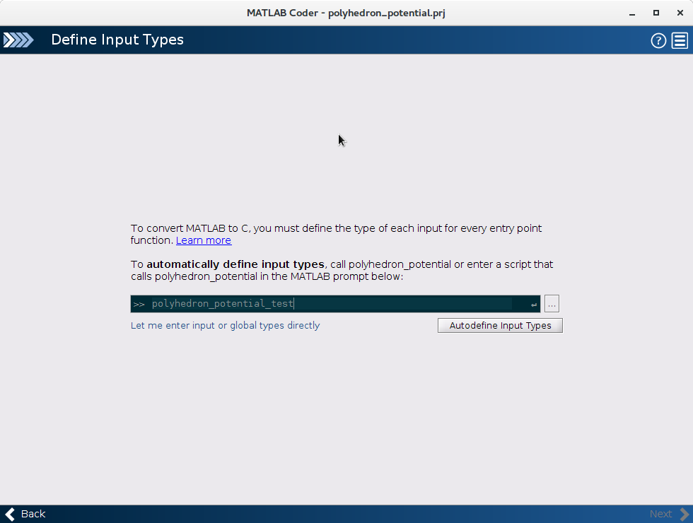
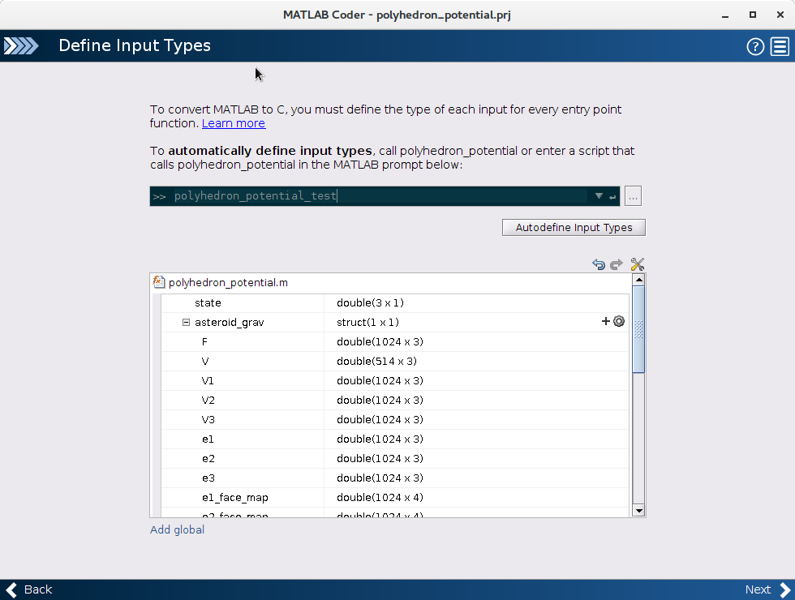

## Matlab Coder Guide

* Open Matlab Coder by typing `coder` or going in the menu bar to `Apps - Matlab Coder`
    1. Matlab Apps 
    2. Matlab Coder 
* Define the matlab function you want to convert
    
* Define a test function which calls the matlab function to automatically determine the size of inputs
    
    
* Set to generate a mex function. Compile both a 1024 and 4092 face version
    

    